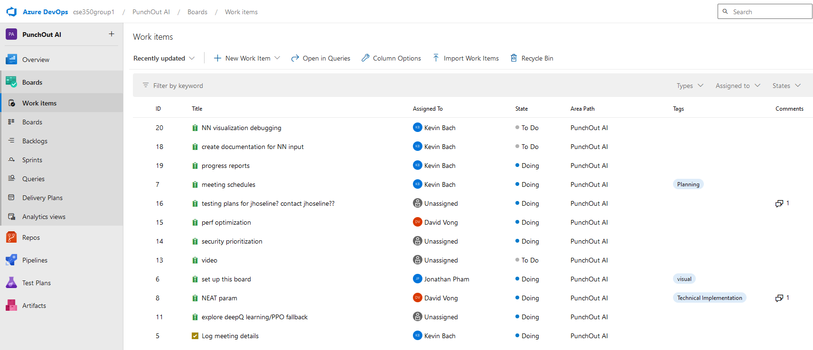
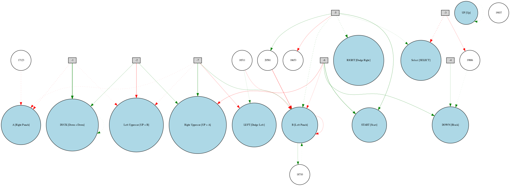

# **AI for Punch-Out!! using NEAT**

This a class group project from UofL's CSE 350-75-4248 course. 
Our team members are Group 1 
- David Vong (Main Developer)
- Jonatham Pham (Project Manager)
- Kevin Bach (Assistant MD and PM)
- Muhammad Toshtemirov (Tester)
- Jhoseline Abarca (nothing...)

## **Overview**  
This project leverages NeuroEvolution of Augmenting Topologies (NEAT) to train an AI capable of playing the classic NES game *Punch-Out!!*. By evolving strategies and neural networks, our AI learns to recognize opponent patterns, adapt its gameplay, and improve over time—all without requiring pre-training or large datasets.  

## **Key Features**  
- **AI-Driven Gameplay:** The AI plays *Punch-Out!!* autonomously, learning strategies through NEAT-based reinforcement learning.  
- **NeuroEvolution:** Our approach starts with simple neural networks, which evolve in complexity to handle the increasing challenges of the game.  
- **Innovative Fitness Function:** The AI’s performance is guided by a custom fitness function, encouraging smarter decisions like dodging, counterattacking, and managing stamina.  
- **Retro Game Emulation:** Built to interact with emulators for seamless gameplay.  

## **Why NEAT?**  
NEAT is a cutting-edge algorithm inspired by evolution. Unlike traditional AI models that require extensive datasets, NEAT dynamically evolves its neural networks by adding complexity only when necessary. This makes it ideal for solving problems where patterns and behaviors emerge over time—like mastering *Punch-Out!!*.  

## **Demo**  
Check out the [YouTube video](https://youtu.be/Ip3LPCP3ccA) showcasing the AI in action! The demo highlights the training process, technical challenges, and the AI's ability to adapt and play effectively.  

## **How It Works**  
1. **Game Simulation:**  
   The AI interacts with the *Punch-Out!!* emulator, receiving inputs and sending commands to control the player character.  
2. **Training Process:**  
   - A population of neural networks is initialized.  
   - Each network is tested by playing the game.  
   - Fitness scores are calculated based on performance (e.g., damage dealt, punches dodged, matches won).  
   - NEAT evolves the networks, iterating until optimal strategies emerge.  
3. **AI Behavior:**  
   Over time, the AI learns to:  
   - Recognize opponent patterns.  
   - Execute precise actions under pressure.  
   - Adapt to different opponents and their strategies.  

## **Key Files**  
- **`NEAT_Parallelization.py`**: The primary script to train the AI using NEAT through multi-threaded core processing found in the **gameSetup** folder.
- **`config-feedforward`**: Configuration file for the NEAT algorithm.  
- **`Neural_Network.py`**: Code to implement the most up-to-date trained neural network in **`winner.pkl`** to play the game.
- **`README.md`**: This file! Explains the project for new users.  

## **Installation (Required)**  
While this repository is intended for evaluation without execution, the project is compatible with Python 3.10+ and includes the following key dependencies:  
- **`neat-python`**: Library for NEAT-based neural networks.  
- **`pygame`**: For interacting with the emulator.  
- **`requirements.txt`**: All other dependencies can be downloaded with `pip install -r requirements.txt` in a virtual environment

This project also requires a linux installation to run. For a guide on how to setup WSL (Windows Subsystem Linux) on a Windows environment, follow the README and youtube video found at the [**features**](https://github.com/dvong1/PunchOut-RL/tree/features) branch or watch this [video](https://youtu.be/h5RGrSQpR2E) created by me!

## **Challenges and Innovations**  
- Designing a robust fitness function that captures the complexities of *Punch-Out!!*.  
- Balancing network evolution to avoid overfitting or stagnation.  
- Overcoming technical issues in connecting NEAT with the game emulator.
- Navigating collaboration and project management through Git and Azure DevOps
- 

## **Future Work**  
- Expanding the AI’s capabilities to tackle other games or real-world problems.  
- Exploring hybrid algorithms combining NEAT with deep learning for greater adaptability.
- 

## **Acknowledgments**  
We’d like to thank our professor for their guidance, as well as the developers of the NEAT and Retro libraries for their incredible tools.  

## **Contact**  
For any questions, feel free to open an issue or contact us directly:  
- **[David Vong]** (dpvong01@louisville.edu)  

